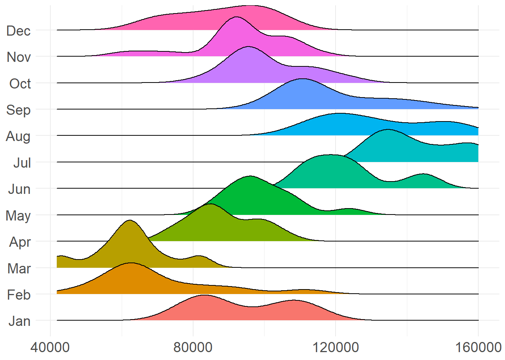
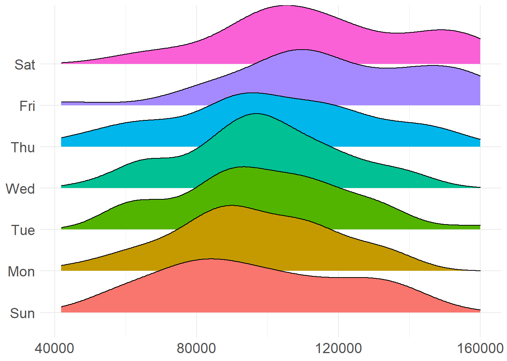

<style type="text/css">
div.sourceCode {
    overflow: hidden;
}
</style>


## Permanent Traffic Count Stations in TRPA Region (2018)


```r
map<-continuous %>% distinct(lat,lon, station)
  map %>%
  st_as_sf(coords=c("lon", "lat"), crs=4326) %>% 
  leaflet() %>% addTiles() %>% addMarkers(popup = paste(map$station))
```

preserve2f2a028dbaae6f18

## Total Daily Totals


```r
ggplotly(
  continuous %>% group_by(Day) %>% 
    summarise(Count=sum(Count)) %>% ggplot(aes(Day, Count)) + 
    geom_col() + theme(axis.title.x=element_blank()) +
    theme_minimal() + scale_x_date() 
  )
```

preservee0a3e35cf758e07b

## Hourly Count Distribution


```r
ggplotly(
ggplot(data = continuous, aes(x = Count)) + 
   geom_histogram(aes(y=..density..),colour="black", fill="white") +
  geom_density(alpha=.2, fill="#FF6666") + 
   theme(axis.title.x = element_blank(), axis.text.y=element_blank(), axis.title.y=element_blank()) + theme_minimal()
)
```

preservebe242b73e5b0c40d


## Daily Count Distribution


```r
ggplotly(
continuous %>% 
  group_by(Day) %>% 
  summarise(Count=sum(Count, na.rm=T)) %>% 
  ggplot(aes(Count)) +
  geom_histogram(aes(y=..density..),colour="black", fill="white") +
  geom_density(alpha=.2, fill="#FF6666")  +
  theme_minimal() +
  theme(axis.title.x = element_blank(), axis.text.y=element_blank(), axis.title.y=element_blank())
)
```

preserve403462fa9651aee6

## Daily Count Totals Count by Day of Week


```r
all_days<- continuous %>% 
  group_by(weekday, Day) %>% 
  summarise(Count=sum(Count, na.rm=T)) %>% 
  ungroup()

ggplotly(
  ggplot(all_days, aes(Day,Count, group=weekday, color=weekday)) + geom_line() + theme_minimal()) %>%
  layout(legend = list(orientation = "h", x = 0.0, y = -0.3)) 
```

preserve262284070c6ac666

## Summary Statistics all Data

```r
options(scipen=999)

ggplotly(
continuous %>%
  group_by(Day,month, weekday) %>%
  summarise(Count=sum(Count,na.rm=T)) %>%
ggplot(aes(x = weekday, y = Count, color = weekday)) +
  theme(axis.text.x=element_blank(), axis.title.x=element_blank(), axis.title.y=element_blank(), axis.ticks.x=element_blank()) +
  geom_boxplot(outlier.shape = NA) +
  facet_grid(~month) + theme(legend.position="bottom") + ggtitle("Traffic Counts") +
  scale_color_manual(values=c("#08D6DA", "#06378D", "#BE0B05", "#F7A537", "#DEF006", "#35AA27", "#940CD8")), height=800) %>%
  layout(legend = list(orientation = "h", x = 0.0, y = -0.2)) %>%
  style(legendgroup = NULL)
```

preserve237f0d65c4ad9c22


## Median Daily Total Counts by Day of Week

```r
ggplotly(
continuous %>% 
  group_by(weekday, month,Day) %>% 
  summarise(Count=sum(Count, na.rm=T)) %>% 
  group_by(weekday, month) %>% 
  summarise(median_count=median(Count)) %>%
  ungroup() %>%
  ggplot(aes(month,median_count, group=weekday, color=weekday)) + geom_line(size=1) + theme_minimal() + 
  theme(legend.position="bottom", legend.title = element_blank(), axis.title.x=element_blank(), axis.title.y=element_blank()) +
  scale_colour_manual(values=c("#08D6DA", "#06378D", "#BE0B05", "#F7A537", "#DEF006", "#35AA27", "#940CD8"))
)
```

preserveba8565dae5946e1f

## Daily Count Distribution by Month of Year


```r
options(scipen=999)

continuous %>%
  group_by(Day, month) %>%
  summarise(Count=sum(Count,na.rm=T)) %>%
  ggplot(aes(x = Count, y = factor(month), fill=month)) +
  ggridges::geom_density_ridges(stat = "density", aes(height = stat(density))) +
  theme_minimal() + scale_fill_discrete() + 
  theme(axis.title.y = element_blank(), legend.position="none", axis.text.y=element_text(size=14), axis.text.x=element_text(size=14), axis.title.x=element_blank())
```



## Median Daily Count by Month of Year


```r
ggplotly(
continuous %>% 
  group_by(Day, month) %>%
  summarise(Count=sum(Count,na.rm=T)) %>%
  group_by(month) %>%
  summarise(Count=median(Count)) %>% 
  ggplot(aes(month, Count)) + geom_col() + theme_minimal() +
   theme(legend.title = element_blank(), legend.position = 'bottom', axis.title.x=element_blank(),axis.title.y=element_blank(), axis.text.y=element_blank(),
        axis.text.x=element_text(size=12)) 
)
```

preservee0ec15417922fd73

## Daily Count Distribution by Day of Week


```r
options(scipen=999)
continuous %>%
  group_by(Day, weekday) %>%
  summarise(Count=sum(Count,na.rm=T)) %>%
  ggplot(aes(x = Count, y = factor(weekday), fill=weekday)) +
  ggridges::geom_density_ridges(stat = "density", aes(height = stat(density))) +
  theme_minimal() + scale_fill_discrete() + 
  theme(axis.title.y = element_blank(), legend.position="none", axis.text.y=element_text(size=14), axis.text.x=element_text(size=14), axis.title.x=element_blank())
```



## Median Daily Count by Day of Week


```r
ggplotly(
continuous %>% 
  group_by(Day, weekday) %>%
  summarise(Count=sum(Count,na.rm=T)) %>%
  group_by(weekday) %>%
  summarise(Count=median(Count)) %>% 
  ggplot(aes(weekday, Count)) + geom_col() + theme_minimal() +
   theme(legend.title = element_blank(), legend.position = 'bottom', axis.title.x=element_blank(),axis.title.y=element_blank(), axis.text.x=element_blank(),
        axis.text.y=element_text(size=12)) + coord_flip()
)
```

preservec97555d226306ae1

## Daily Count Distribution by Day of Week

## Counts for Entry/Exit Stations only by Day of Week

```r
ggplotly(
continuous %>% 
  filter(ext_int=="External Station") %>%
  group_by(Day, weekday) %>%
  summarise(Count=sum(Count,na.rm=T)) %>% 
  group_by(weekday) %>%
  summarise(Count=median(Count)) %>% 
  ggplot(aes(weekday, Count,)) + geom_col() + theme_minimal() +
  theme(legend.title = element_blank(), legend.position = 'bottom', axis.title.x=element_blank(),axis.title.y=element_blank(), axis.text.x=element_blank(),
        axis.text.y=element_text(size=12)) + coord_flip()
)
```

preserve8d31d26d833504a0

## Counts Entry/Exit Stations only by Month


```r
ggplotly(
continuous %>% 
  filter(ext_int=="External Station") %>%
  group_by(Day, month) %>%
  summarise(Count=sum(Count,na.rm=T)) %>%
  group_by(month) %>%
  summarise(Count=median(Count)) %>%
  ggplot(aes(month, Count)) + geom_col() + theme_minimal()  +
 theme(legend.title = element_blank(), legend.position = 'bottom', axis.title.x=element_blank(),axis.title.y=element_blank(), axis.text.x=element_blank(),
        axis.text.y=element_text(size=12))  + coord_flip()
)
```

preserve4d071fba40fd4822


